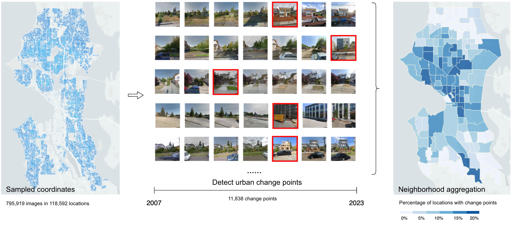

# CityPulse

### [[Paper]](https://arxiv.org/abs/2401.01107) [[Citing]](https://github.com/tianyuanhuang/citypulse?tab=readme-ov-file#citing) [[Model Checkpoint]](https://huggingface.co/ZejiaW/CityPulse-DINOv2) [[Project Page]](https://tianyuanhuang.github.io/citypulse_web/) [[AAAI 2024]]()



Welcome to the official repository of **CityPulse**! CityPulse is a project aimed at capturing changes in the urban built environment and providing fine-grained assessments of urban development and changes through large-scale time-series of street view images. We have curated the largest annotated dataset of street view time-series to date and have fine-tuned a siamese change detection model on this dataset. The intention behind releasing the data, model, and code is to provide the research community with more comprehensive and extensive resources, facilitate broader downstream research on urbans, and advance sustainable development goals.


## Data


## Models

### Install Conda Environment
Please visit the [Anaconda install page](https://docs.anaconda.com/anaconda/install/index.html) if you do not already have conda installed.
```sh
conda env create -f citypulse.yaml
conda activate citypulse
```

### Fine-tune
To run our fine-tuning Python script, please execute the following command in the command line:
```sh
python ./src/finetune.py --mode train
```
You can adjust the hyperparameters required for training in the file ``src/configs/finetune.yml``. The comments in this file explain the meanings of the hyperparameters. Note that the parameters ``model_type`` and ``dino_patch_size`` vary depending on the different backbone models loaded. For example, for *DINOv2*, we set ``model_type="vitb", dino_patch_size=14``; for *CLIP*, we set ``model_type="ViT-B", dino_patch_size=16``; and for *DINO*, we set ``model_type="vit_base", dino_patch_size=16``.

To test the fine-tuned model on the test set, please run the following command:
```sh
python ./src/finetune.py --mode test --checkpoint /YOUR/CKPT/PATH.ckpt
```
To run the ``finetune.py`` script, whether downloading our data or using customized data, you will need a CSV file to index and organize your data. This file should store the storage paths and capture times of the two images in each image pair, as well as information such as the sequence index, city, and labels to which the image pair belongs.

### Inference with Our Fine-tuned Dinov2-Siamese Model
To use our fine-tuned model for inference, first download our model checkpoint from [Hugging Face](https://huggingface.co/ZejiaW/CityPulse-DINOv2). After modifying the data loading class in ``./src/SiamDINOv2_inference.py`` as per your requirements, you can execute inference by running the following command:
```sh
python ./src/SiamDINOv2_inference.py --data_idx /YOUR/DATA/INDEX.csv --checkpoint /Your/CKPT/PATH.ckpt --with_label True
```


### Pre-train
In addition to directly loading the pre-trained model, we have also attempted to design and pre-train the *StreetBYOL* model and the *StreetMAE* model, based on a large amount of unlabeled data.

In this section, we first reconstructed the unlabeled dataset. We assigned index to each image in all image sequences and utilized [STEGO](https://github.com/mhamilton723/STEGO) to segment the images, extracting the buildings and background separately. This also allowed us to calculate the proportion of pixels semantically identified as buildings in the entire image. We saved the original image, the building part of the original image, the background part of the original image, the corresponding positive sample of the original image, the building part of the positive sample, and the background part of the positive sample in six subdirectories under the data root, naming the images by their index. 

```
dataset
|── img
|   |── img_0.jpg
|   ├── img_1.jpg
|   └── ...
|── img_building
|   |── img_building_0.jpg
|   ├── img_building_1.jpg
|   └── ...
|── img_bg
|   |── img_bg_0.jpg
|   ├── img_bg_1.jpg
|   └── ...
|── pos_img
|   |── pos_img_0.jpg
|   ├── pos_img_1.jpg
|   └── ...
|── pos_building
|   |── pos_building_0.jpg
|   ├── pos_building_1.jpg
|   └── ...
└── pos_bg
    |── pos_bg_0.jpg
    ├── pos_bg_1.jpg
    └── ...
```
We defined the positive sample of an image as the image taken at the same location and closest in time to the anchor image.

* For the *StreetBYOL* pre-training, please refer to the ``./src/byol_pretrain.py`` script and the corresponding configuration file ``./src/configs/byol_pretrain.yml``.
* For the *StreetMAE* pre-training, please refer to the ``./src/mae_pretrain.py`` script and the corresponding configuration file ``./src/configs/mae_pretrain.yml``.

## Licence


## Citing

If you found this project useful, please consider citing:

```bibtex
@article{huang2024citypulse,
  title={CityPulse: Fine-Grained Assessment of Urban Change with Street View Time Series},
  author={Huang, Tianyuan and Wu, Zejia and Wu, Jiajun and Hwang, Jackelyn and Rajagopal, Ram},
  journal={arXiv preprint arXiv:2401.01107},
  year={2024}
}
```

## Contact
For feedback, questions, or press inquiries please contact [Tianyuan Huang](mailto:tianyuah@stanford.edu).
